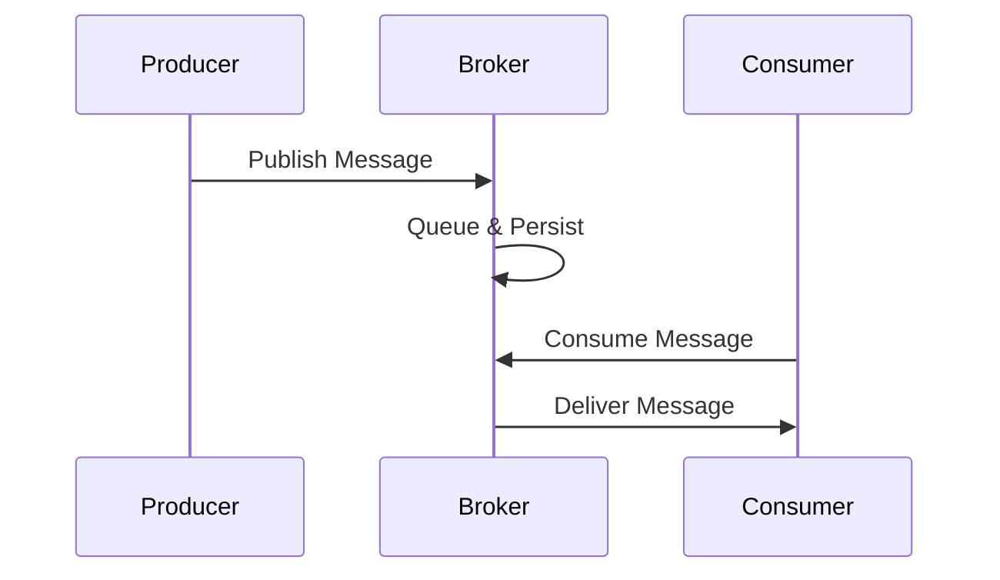

## Overview

Message queuing enables asynchronous communication between services by storing messages in queues until consumers process them. You use brokers like RabbitMQ, Redis, or Kafka to manage producers sending messages and consumers retrieving them. This decouples applications, improves scalability, and ensures reliability even during failures.

Core benefits include load balancing across workers, fault tolerance through message persistence, and flexible routing patterns like fanout or topic-based exchanges.



## Popular Message Brokers

Compare RabbitMQ, Redis Streams, and Kafka based on use cases, performance, and features.

<Tabs>
  <Tab title="RabbitMQ" icon="rabbit">

RabbitMQ excels in complex routing with exchanges and queues. Use it for task queues, RPC, and pub/sub patterns.

<CodeGroup tabs="Node.js,Python">
  ```javascript
  const amqp = require('amqplib');
  async function publish() {
    const conn = await amqp.connect('amqp://localhost');
    const channel = await conn.createChannel();
    await channel.assertQueue('tasks');
    channel.sendToQueue('tasks', Buffer.from('Hello World'));
  }
  ```
  ```python
  import pika
  connection = pika.BlockingConnection(pika.ConnectionParameters('localhost'))
  channel = connection.channel()
  channel.queue_declare(queue='tasks')
  channel.basic_publish(exchange='', routing_key='tasks', body='Hello World')
  ```
</CodeGroup>

  </Tab>
  <Tab title="Redis" icon="database">

Redis Streams provide lightweight ordered messaging. Ideal for real-time apps and simple pub/sub.

<CodeGroup tabs="Node.js,Python">
  ```javascript
  const redis = require('redis');
  const client = redis.createClient();
  await client.connect();
  await client.xadd('mystream', '*', 'message', 'Hello Redis');
  ```
  ```python
  import redis
  r = redis.Redis(host='localhost', port=6379)
  r.xadd('mystream', {'message': 'Hello Redis'})
  ```
</CodeGroup>

  </Tab>
  <Tab title="Kafka" icon="trending-up">

Kafka handles high-throughput streaming with partitions and topics. Perfect for log aggregation and event sourcing.

<CodeGroup tabs="Java,Python">
  ```java
  Properties props = new Properties();
  props.put("bootstrap.servers", "localhost:9092");
  props.put("key.serializer", "org.apache.kafka.common.serialization.StringSerializer");
  KafkaProducer<String, String> producer = new KafkaProducer<>(props);
  producer.send(new ProducerRecord<>("mytopic", "Hello Kafka"));
  ```
  ```python
  from kafka import KafkaProducer
  producer = KafkaProducer(bootstrap_servers='localhost:9092')
  producer.send('mytopic', b'Hello Kafka')
  ```
</CodeGroup>

  </Tab>
</Tabs>

## Key Concepts

<Columns cols={3}>
  <Card title="Queuing" icon="package">
    Messages wait in FIFO queues until acknowledged by consumers.
  </Card>
  <Card title="Streaming" icon="trending-up">
    Append-only logs enable replay and exactly-once semantics.
  </Card>
  <Card title="Architecture" icon="settings">
    Design with clustering, federation, and sharding for high availability.
  </Card>
</Columns>

## Best Practices

<Callout kind="tip">
Follow these practices to build scalable, reliable systems with AceMQ expertise.
</Callout>

<Steps>
  <Step title="Enable Persistence" icon="database">
    Configure durable queues and persistent messages to survive broker restarts.
  </Step>
  <Step title="Monitor Metrics" icon="bar-chart">
    Track queue lengths, consumer lag, and throughput using Prometheus.
  </Step>
  <Step title="Handle Failures" icon="shield">
    Implement dead letter queues for failed messages and retries.
  </Step>
</Steps>

## Integration Strategies

<ExpandableGroup>
  <Expandable title="Cloud Environments" default-open="true">
    Deploy brokers on Kubernetes with Helm charts. Use managed services like Amazon MQ or Confluent Cloud for RabbitMQ and Kafka.
  </Expandable>
  <Expandable title="Microservices">
    Integrate with service meshes like Istio for traffic management and observability.
  </Expandable>
  <Expandable title="Legacy Systems">
    Bridge queues to HTTP APIs or databases using connectors like Apache Camel.
  </Expandable>
</ExpandableGroup>

<Callout kind="info">
AceMQ provides consulting for custom integrations. Customize these concepts for your environment.
</Callout>